# intel-oneAPI

#### Team Name - **Phoenix 13**
#### Problem Statement - **Open Innovation in Education**
#### Team Leader Email - **saumya.srivastava_cs.aiml21@gla.ac.in**

**Intel Official AI Blog Page:**
https://community.intel.com/t5/Blogs/Tech-Innovation/Artificial-Intelligence-AI/Building-an-Interactive-Educational-Platform-Using-Intel-AI/post/1585262

**Intel Dev News Youtube Short (April 2024)**
https://www.youtube.com/shorts/RTfQKs1ekZg

## A Brief of the Prototype:

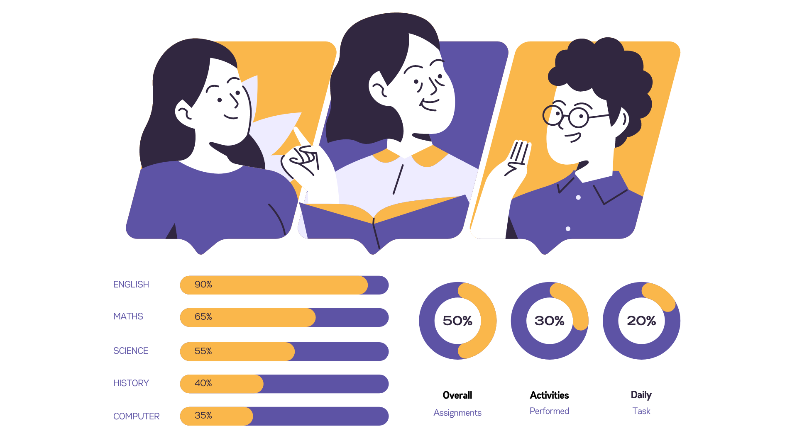

Quality education is the path to transcendence and making this journey more engaging is the sole purpose of our project. We intend to include features that would provide an interactive interface to the user where he/she can have a more precise watch on his/her performance, explore their areas of interest, and connect with people of the desired field in the vicinity using the real-time trained DL and ML model. 

Making the learning more innovative we would allow them to create chatrooms for discussions on projects, academics, areas of interest, etc., and also help them with auto-generated suggestions. 

Creating fun and amazing pet avatars in which the capital to unlock new features would be through their scores that would be auto-generated based on their day-to-day progress in activities as well as academics.

Apart from learning, we would also take care of their mental health by creating interactive chatbots which could judge a child's mental state and provide suitable help. Thus, providing a pool of exploration alongside fun and healthy competition would help in the overall development of the student.

## How it works?


The user interactions related to learning would be duly recorded. These recordings will be taken as input features for our Intel oneAPI oneDNN and oneDAL integrated ML and DL models. These models will further make predictions, cluster the students according to their areas of interest, generate visualization for their progress in each of their domains/subjects, and provide the candidates with study material recommendations whether it is a video, blog, or book.
Some fun activities and assessments to help them, co-op with their studies, which in turn will be recorded and a ranking system amongst the students say class-wise, section-wise, or campus-wise will provide them scores for performing well in those activities and classes and rank them accordingly, creating a healthy competitive environment.

During Covid-19, when everything had shifted to online mode, students used to get bored and drowsy during classes and it was not possible to keep a check on each and every student. Through our project, we would train the model to check if the person is getting drowsy and recommend him some auto-generated exercises that would help him get his focus back. Most institutions stick to the old school analysis systems in which the student is never able to understand specifically in which area, he/she should improve in order to maintain his academic results, but through our project, he/she can get a detailed analysis of his performance with day to day updates which will keep him/her more aware about his situation in every area.

# List of features offered by the solution

## Vision

Making learning more interactive and innovative by providing a clearer picture along with some fun elements, here we list the features of our project bifurcated into three categories.

## Category - 01   (Academic)


01. An advanced ranking system that will be updated on a day-to-day basis which would be based on the overall performance during lectures, projects, assignments, and quizzes.

02. Keeping track of the attendance of the student in every subject and sending reminders to attend lectures on subjects in which his attendance is going down at an alarming rate.

03. Providing him/her proper insights about the areas he is currently lacking in along with auto-generated suggestions of resources to study from. 

04. A separate area for assignment submission along with a plagiarism checker. The plagiarism checker would keep on updating itself with each assignment submission. If it receives an assignment with exactly the same content, the student would receive a notification to resubmit another assignment as the presently submitted assignment might be up for plagiarism.

05.  A highlight section that would keep them connected to the world. Giving them a daily insight into what's happening around the globe, especially their areas of interest.

## Category - 02  (Gamification)


01. Improvisation of the ranking system through day-to-day digital badge system. Every day the student who has outperformed everyone else by giving more quizzes and doing his assignments would be provided with the student of the day batch.

02. Interactive quizzes through facial gestures. Multiple choice  questions would be answered with the movement of the head. 

03. Adding some fun virtual elements, there will be a performance-wise token credit system in this Gamification Centre. Based on this credit, the students can unlock new features for their virtual pet. 

## Category - 03  (Student Insights)


01. Checking on the mental health of the student, there will be interactive mental health chatbots. In case the student needs any kind of help, he/she can be provided immediate assistance.

02. Detection of drowsy and low behaviour during online lectures. If the student has been feeling drowsy for a certain period of time during the lecture, then some easy sitting exercises will be suggested in order to tackle the drowsiness. 

03. The students can create chatrooms where all the interested can pitch in for a project, assignment, etc. In case they need a mentor, then we can provide them with suggestions from the faculty experts in that field.

## Our Models


# Student Login/Register

Firstly we present you the login and register page. First time visitors will have to register themselves to the portal in order to enjoy the benifits of the dashboard. They also need to enter their favourite category which would influence the outputs generated by the recommendation system. The already registered students just need to fill in the email and password.

#### Registration Page


#### Login Page


# Dashboard

Now the new student is welcomed with the dashboard welcome message. Here we have the weather API that would Fetch the current information about the weather and keep the dashboard more updated with the outside world, keeping the student well informed. Nextly we have the rank of the student represented in the form of graphs. These graphs display the rank class-wise, section-wise and school-wise separetely. So that students are always well informed of their performance and the scope of improvement.
Now there will be a alert or notification section as well, where the alerts from the admins will be presented. The next section includes the attendance for all the subjects along with the average attendance. Next is a piechart showing the number of assignments submitted where the student will get to know how many assignments are still left to submit. After that, we have the Learners'Ed Coin Bank, which tells us how many coins are left with the user and on the right side we have our virtual pet information, such as pet name, level and rank.
At last, we have the recommendation section where the category selected would determine which type of videos will be fetched for the student and be presented in the recommendation section. 

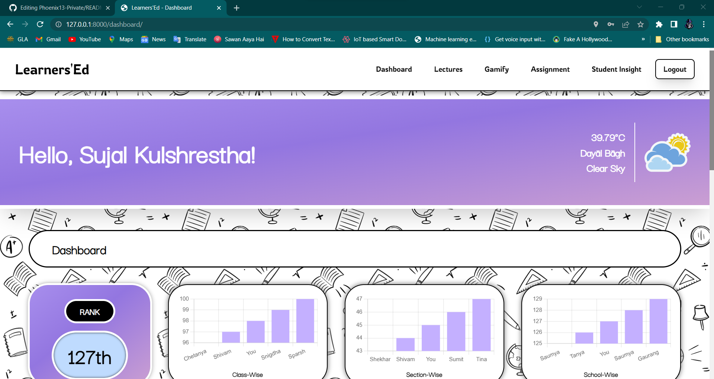

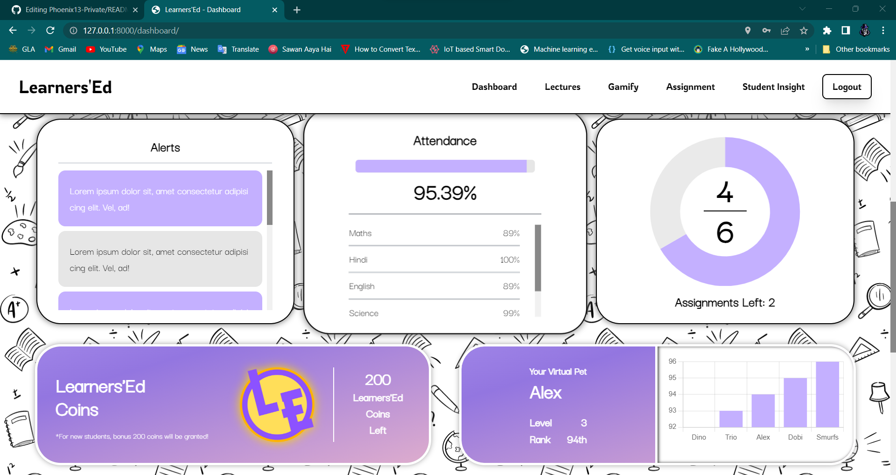


# Lecture Section

Now we have the lecture section where all of the lectures recommended for the students are listed here. The student can watch that lecture by clicking on the watch button after going into the lecture section. We are also introducing a 'Drowsiness Detection System', in which if any teacher uploads a lecture, this system would track down the time for which a student has been actively listening during the lecture and would provide the attendance accordingly. However, we understand, that online lectures can get a little boring and tiresome. So, in order to tackle that when the system would notice that the student hasn't been attentive for a certain period of time, it would pause the video and generate a promt that would suggest an easy sitting exercise that could help them regain their focus and not miss on the learning. Once he/she has done the exercise and is fresh again, he/she can click on the 'OK' button and continue with his lecture.

#### Lecture List

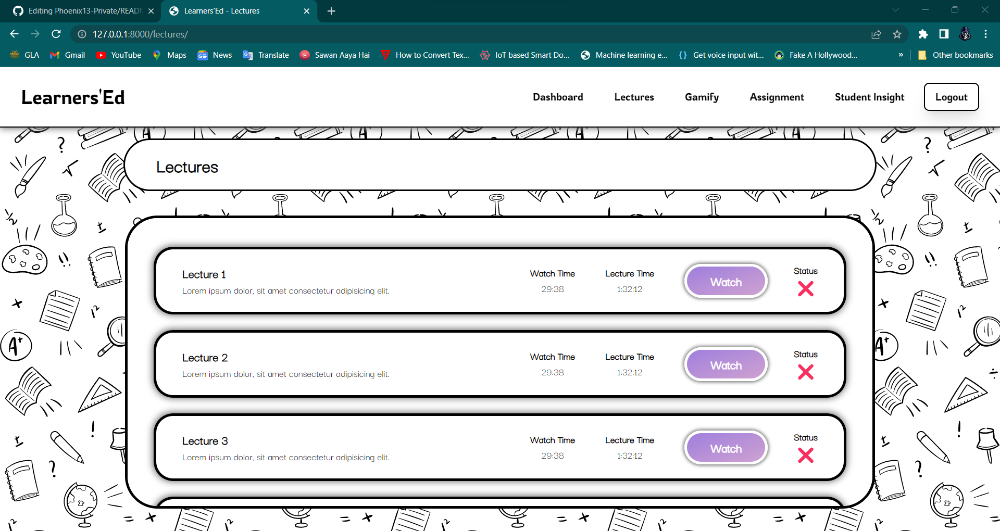

#### Not Drowsy


#### Drowsy


# Drowsiness Detection System
 
You can acces the drowsiness detection model used behind this, present in the AIML Modules Folder.

The provided code in the AIML modules folder implements a drowsiness detection model using Convolutional Neural Networks (CNNs). Here is a summary of the code functionality:

Importing necessary libraries: The code starts by importing the required libraries, including PIL, OpenCV, face_recognition, TensorFlow, and Keras.

Eye Cropping Function: The eye_cropper function takes an image path as input and uses OpenCV and face_recognition to locate the eyes in the image. It crops the eye region, resizes it to 80x80 pixels, and returns the cropped image for further processing.

Loading Images from Dataset: The load_images_from_folder function loads images from the specified folder and resizes them to 80x80 pixels. It assigns a label (0 for open eyes, 1 for closed eyes) and creates a list of image-label pairs.

Preparing the Dataset: The code creates arrays for input images (X) and corresponding labels (y). It iterates through the image-label pairs, appends the images to X, and labels to y. The images are reshaped, normalized, and the labels are converted to arrays.

Splitting the Dataset: The dataset is split into training and testing sets using the train_test_split function from sklearn. The splitting is stratified based on the labels to maintain class balance in both sets.

Model Definition: The code defines the CNN model using the Sequential API of Keras. It includes convolutional layers, max-pooling layers, dense layers, and dropout layers for regularization.

Model Compilation and Training: The model is compiled with binary cross-entropy loss and Adam optimizer. It is then trained on the training data, using the fit function, for 24 epochs. The validation data is used to monitor the model's performance during training.

Model Evaluation: The trained model is evaluated on the testing data using the evaluate function. The evaluation results, including loss and metrics, are printed.

Model Saving: The trained model is saved to a file using the save function.

Prediction Function: The model_response function takes an image and uses the eye_cropper function to extract the eye region. The preprocessed image is then passed to the trained model for prediction. If the predicted probability of closed eyes exceeds a threshold, the function returns 'Yes,' indicating drowsiness.

Model Usage: The model_response function is called with an image to demonstrate the usage of the trained model.

In summary, the code prepares and trains a CNN model to classify eye states as open or closed for drowsiness detection. It provides a function to extract eye regions from images and a function to classify the eye state using the trained model.

# Intel Optimization Applied

Along with the normal model we have applied Intel oneDNN with OpenMP and scikit-learn-intelex, the scikit learn optimization by intel, which further leverages our model preformance. Using these optimization tools helped us getting more inferences in less time and train our model very fast as well

Note: We have trained our model using intel oneAPI AI analytics toolkit oneDNN and OpenMP on intel i5 11th gen 11260H 6 core 12 thread computer.

Here are the OpenMP params used

inter: 6

intra: 6

KMP_BLOCKTIME: 1

Test_Set: 25

#### Benchmarks Rates

Inference Time Rate: 1.1440191387559806

Latency Rate: 0.8741112505227936

Throughput Rate: 1.1440191387559806

Training Time Rate: 0.438332327047551

Here is the benchamarking difference between the model trained on normal cpu vs on intel optimization, same hardware better performance!


# Gamify Section

Now coming to the most entertaining section of the LearnersEd Portal, the gamify section. Here the students are encouraged to sharpen their minds along with having a fun competitve environment amongst them. There are two section here gamify quiz and virtual pet.

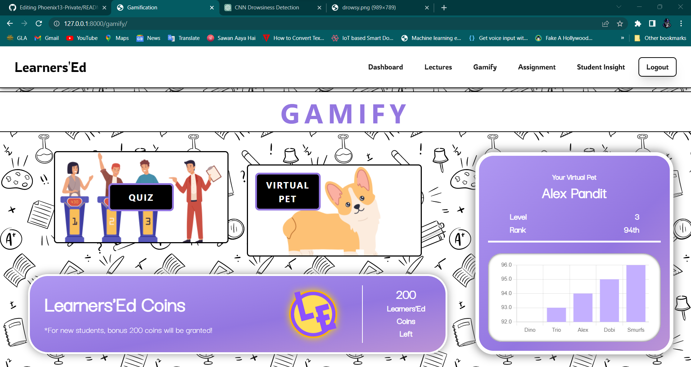

## Gamify Quiz 

Here the students are presented with a quiz, but the twist is the answers are not selected by mouse or keyboard input, the options are selected by their head posture and this would reduce their decision taking time and would improve their reflexes to act upon situations, every student needs to attentively solve the quiz and then after the quiz they would get Learners'Ed Coins according to the marks they scored.


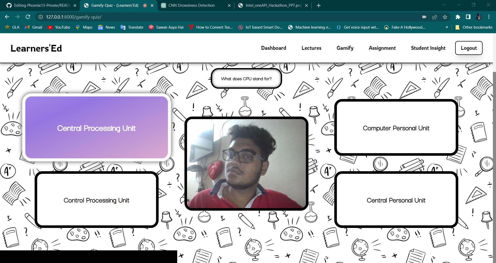


This module is supported by Face Pose detection model developed by us.

# Face Pose Detection System

The provided code performs head pose estimation using a machine learning model. Here is a technical write-up summarizing its functionality:

Data Loading: The code loads the input data from a pickle file. It consists of images as input samples (x) and corresponding head pose angles (y).

Data Preprocessing: The head pose angles (y) are split into three components: roll, pitch, and yaw. The code then prints the minimum, maximum, mean, and standard deviation values for each component to provide insights into the data distribution.

Dataset Splitting: The input data (x and y) is split into training, validation, and testing sets using the train_test_split function from scikit-learn. The training set contains 70% of the data, and the remaining 30% is evenly divided between the validation and testing sets.

Data Standardization: The StandardScaler is applied to standardize the input features (x_train, x_val, and x_test) by subtracting the mean and scaling to unit variance.

Model Architecture: The code defines a neural network model using the Sequential API from Keras. The model consists of three dense layers with ReLU activation. The first two layers have regularization using L2 kernel regularization.

Model Compilation and Training: The model is compiled with the Adam optimizer and mean squared error (MSE) loss function. It is trained on the training data with early stopping based on the validation loss. The training progress is stored in the hist variable.

Model Saving: The trained model is saved to a file named "model.h5".

Model Evaluation: The code evaluates the trained model on the training, validation, and testing sets, printing the loss values for each set.

Visualization: The training and validation loss curves are plotted to visualize the model's training progress.

Face Point Detection: The code defines a function detect_face_points that uses the dlib library to detect the 68 facial landmarks on an input image.

Feature Computation: The compute_features function calculates pairwise Euclidean distances between the detected facial landmarks, resulting in a feature vector.

Feature Standardization: The computed features are standardized using the same StandardScaler instance used for the input features.

Model Loading: The saved model is loaded from the "model.h5" file.

Head Pose Estimation: The standardized features are fed into the loaded model to predict the roll, pitch, and yaw angles of the head pose.

Result Visualization: The input image is displayed with the detected facial landmarks and the predicted head pose angles.

In summary, the code performs head pose estimation by training a neural network on a dataset of images and corresponding head pose angles. It preprocesses the data, builds and trains the model, and then uses the trained model to predict head pose angles for new input images. The detected facial landmarks and predicted head pose angles are visualized for analysis and interpretation.

# Intel Optimization Applied

Here we applied oneDNN along with OpenMP and scikit-learn extension which leverages performance for us.

Here are the OpenMP params

inter: 2

intra: 6

KMP_BLOCKTIME: 0

Test_Set: 25

#### Benchmark Rate

Inference Time Rate: 1.0136551020270463

Latency Rate: 0.9865288479289062

Throughput Rate: 1.0136551020270463

Training Time Rate: 0.4256577027908266

Here is the benchmarks difference in normal cpu vs intel optimized cpu


## Virtual Pet

Here comes the virtual pet section, the students have access to their very own virtual pet, they can select from two types as well as assign a name. Initially, the students have pet rank as last and level at 1.  This rank can be improved by earning more and more Learners'Ed coins which they can be gained by taking the quizzes accessible from the gamify section itself. Based on their performance in these quizzes they will be rewarded with a certain number of coins which they can further use to feed their pet. The quanity of coins would keep upgrading itself. with the number of the quizzes they take.

This whole system is developed using javascript code only, no model trained.

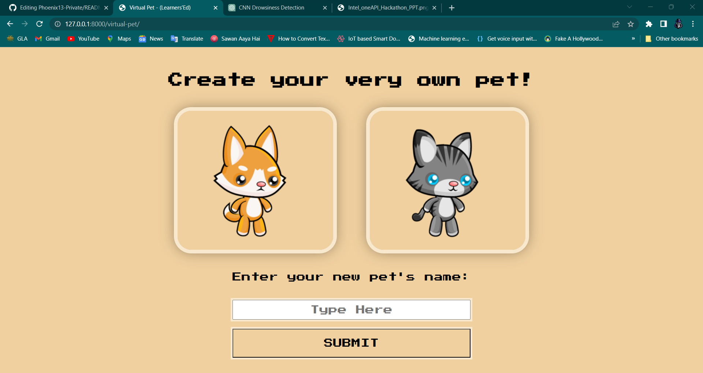

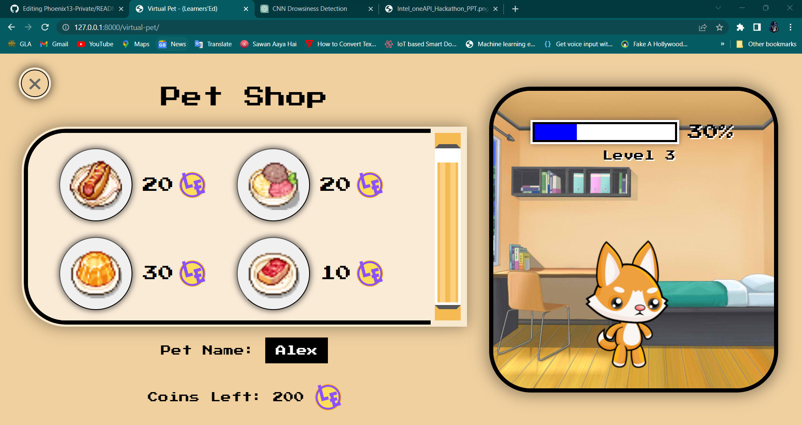

# Assignment Upload Section

Here in this section the students can upload their respective assignments, if however their assignment is matched to other students assignment it would reject the assignment and would not store it, if not then this assignment will be selected an the assignment will be added to the checker list. As the current situation tells us the requirement of plagiarism checker this needs to be the base restriction for our assignment uploading by each student.

#### Accepted

Submitting a unique assignment

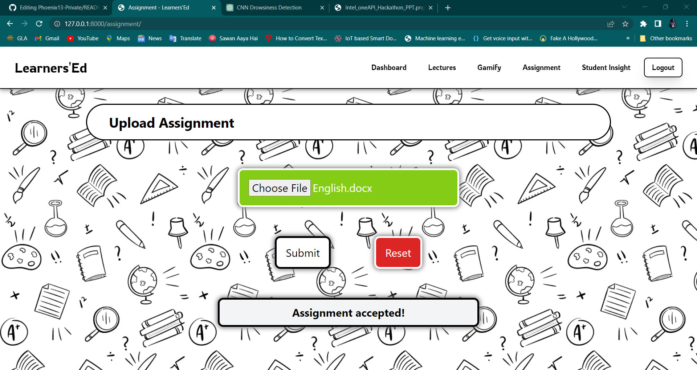

#### Rejected

Submitting a same assignment again


This model is not trained, it just use cosine_similarity and nltk library to calculate plagiarism, so no benchmark is done.

Note: It only accepts doc or docx files for now, we will further extend it to other file types and can integrate a model with it as well.

The provided code performs a plagiarism check on a student's assignment by comparing it with reference assignment files. Here is a technical write-up summarizing its functionality:

Text Preprocessing: The code defines a function preprocess_text that takes a text input and performs preprocessing steps. It removes punctuation, converts the text to lowercase, and removes stopwords using the NLTK library.

Text Extraction from DOCX: The code defines a function extract_text_from_docx that takes a file path to a DOCX document and extracts the text from its paragraphs using the python-docx library.

Plagiarism Check: The code defines a function check_plagiarism that performs the plagiarism check. It takes the file path of the student's assignment DOCX file and a list of reference assignment files.

Student Assignment Processing: The student's assignment is loaded and its text is extracted using the extract_text_from_docx function. The extracted text is then preprocessed using the preprocess_text function.

Similarity Calculation: For each reference assignment file, the code loads the file, extracts its text, preprocesses it, and then calculates the similarity between the preprocessed student assignment and the preprocessed reference assignment. The similarity is measured using the cosine similarity of TF-IDF vectors.

Output: The code returns a list of similarities, where each similarity value represents the similarity between the student's assignment and a reference assignment.

Plagiarism Check Execution: The code sets the file path of the student's assignment and gets a list of reference assignment files in a specified directory. It then calls the check_plagiarism function with these inputs and retrieves the similarities.

Similarity Display: The code iterates over the similarities and prints the similarity value for each reference assignment.

In summary, the code performs a plagiarism check by comparing a student's assignment with a set of reference assignments. It preprocesses the text, extracts the relevant information from DOCX files, calculates the similarity using TF-IDF vectors, and provides a similarity score for each reference assignment. This approach allows for the detection of potential plagiarism by analyzing the textual content of the assignments.

# Students Insight Section


This section is made for students to explore more out of their surrounding peoples and environment, this section is divided into 3 sections. This makes a healthy environment for them in the panel itself, making them feel connected which was a major hit at the time of covid.

## Chatroom

The first one is chatrooms, this chatrooms are available throughout the campus, further these can be sub divided into class-wise, section-wise as well, so that students can chat and get along their coomunity. This will help building a community mindset amongst them and never leave them alone in the lockdown period of covid, making them 
mentally strong. 

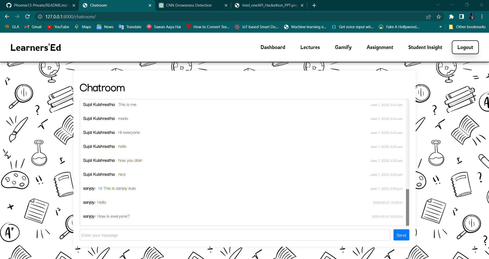

## Mental Health Chatbot

The second section includes mental health chatbot which is a deep learning model trainged chatbot. This model helps the students to discuss their problems with them and give a stress release session with the chatbot. The chatbot gives a helping hand to the students if they face any such mental health issues.

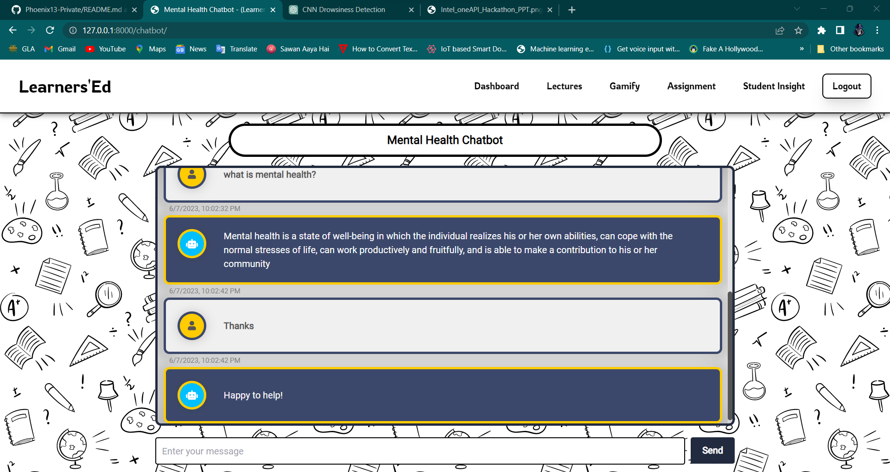

The provided code trains a chatbot model using a sequential neural network for intent recognition and response generation. Here is a technical write-up summarizing its functionality:

Data Loading: The code reads a JSON file containing intents data and creates a pandas DataFrame to store the tag, patterns, and responses.

Data Preprocessing: The patterns from the DataFrame are tokenized using the Keras Tokenizer, which converts the text into sequences of integers. The tokenizer is fitted on the patterns and converts them into sequences.

Input and Output Encoding: The padded sequences of patterns (X) are created using the pad_sequences function from Keras, which ensures that all sequences have the same length. The tags (y) are encoded using the LabelEncoder from scikit-learn, which converts the categorical labels into numerical form.

Model Architecture: The code defines a sequential neural network model using the Keras Sequential API. The model consists of an input layer, an embedding layer, multiple LSTM layers, layer normalization, dense layers, and dropout regularization. The final layer uses softmax activation for multi-class classification.

Model Compilation: The model is compiled with the Adam optimizer and sparse categorical cross-entropy loss, which is suitable for multi-class classification problems. Accuracy is used as an additional metric.

Model Training: The model is trained on the input data (X) and target labels (y) using the fit function. An early stopping callback is included to monitor the accuracy and stop training if it doesn't improve after a certain number of epochs.

Model Response Generation: The code defines a function model_response that takes a user query and the trained model. The query is preprocessed, tokenized, and converted into a sequence. The sequence is padded, and the model predicts the most probable tag for the query. A random response is selected from the responses associated with the predicted tag.

Model Testing: The model_response function is called with example queries to test the chatbot. The user query, model response, and random selected response are printed.

In summary, the code trains a chatbot model for intent recognition and response generation using a sequential neural network architecture. It preprocesses the data, creates a model with LSTM layers, trains the model, and generates responses based on user queries. This approach allows the chatbot to understand user intents and provide appropriate responses.

# Intel Optimization Applied

Here I have used Intel oneDNN with OpenMP, scikit-learn extension, and Moding[ray] Pandas Library which leverages this models performance.

Note: Every model is trained on Intel Python for more optimization.

Here are OpenMP params

inter: 2

intra: 6

KMP_BLOCKTIME: 1

Test_Set: 20

Benchmarking Rates

Inference Time Rate: 2.3821281464139816

Latency Rate: 0.41979269734308167

Throughput Rate: 2.3821281464139816

Training Time Rate: 0.7704980148747786

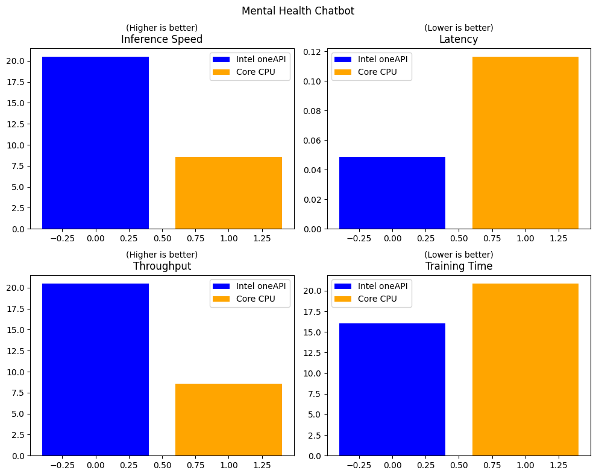

## Explore Fields

The last section inlcudes Explore Fields section which fetches the information from different sets of fields, and present them to the students with the help of popular newsletter API, these gathered pit of useful information makes the student more encouraged to read them, instead of searching and scraping them through the web.


Here is the whole process flow diagram for each model being used.

# Process Flow Diagram


# Summary of Intel oneAPI AI Analytics Toolkit Optimization
To meet the project requirements, we have developed three sophisticated Deep Learning Models that play crucial roles in different sections of our platform. These models have been enhanced with Intel oneDNN and OpenMP optimization, allowing us to achieve exceptional performance gains, including faster training, higher throughput, improved inference speed, and reduced latency.

The first model we have developed is the Drowsiness Detection Model, which is utilized in the Lecture Section. By leveraging Intel oneDNN and OpenMP optimization, we have significantly accelerated the training process of this model. This optimization framework has not only expedited the training phase but has also improved the overall inference speed during real-time drowsiness detection. As a result, students' attendance can be accurately determined based on their active listening time during lectures.

The second model we have incorporated is the Face Pose Estimation Model, which plays a crucial role in the Gamify Quiz section. Through the implementation of Intel oneDNN and OpenMP optimization techniques, we have achieved remarkable improvements in training efficiency, throughput, and inference speed. These optimizations have enabled us to accurately estimate facial movements and gestures during the quiz, providing an engaging and interactive learning experience for students.

Lastly, we have developed a sophisticated Mental Health Chatbot that leverages Intel oneDNN and OpenMP optimization. This optimization framework has significantly enhanced the performance of our chatbot, resulting in faster response times, improved throughput, and reduced latency. By employing Intel's optimization tools, such as scikit-learn-intelex, we have been able to train the chatbot model efficiently and deliver prompt and insightful responses to students seeking support.

The integration of Intel oneDNN and OpenMP optimization in our models has been instrumental in achieving remarkable performance enhancements. The collaboration between our deep learning models and Intel's optimization tools has resulted in faster training processes, higher inference speeds, and improved overall efficiency. These optimizations have enabled us to deliver a seamless and efficient educational experience to our users while ensuring the highest quality standards.

Intel oneDNN (Deep Neural Network Library) is a highly optimized library that provides efficient implementations of deep learning primitives. 
By utilizing Intel oneDNN, our three models benefit from accelerated training, improved throughput, enhanced inference speed, and reduced latency. The library's optimized computations and parallelization techniques optimize the performance of our models, enabling faster and more efficient processing.

OpenMP is an industry-standard API that allows for parallelization of code across multiple processors. With OpenMP, we can leverage multi-threading capabilities to distribute computations among multiple cores or processors, maximizing performance and speeding up training and inference processes for our models. 

This parallelization significantly improves the overall efficiency and scalability of our models.

Modin for Pandas is a powerful library that enhances the performance of Pandas, a popular data manipulation and analysis tool. By integrating Modin, we can scale Pandas operations across multiple processors or nodes, enabling faster data preprocessing and manipulation. This acceleration in data handling benefits our models by reducing the time required for data preparation, leading to quicker model training and improved overall efficiency.
scikit-learn (sklearnex) is a widely used machine learning library that provides various algorithms and tools for tasks such as classification, regression, and model evaluation. 

The test_train_split function from scikit-learn (sklearnex) is particularly helpful in our models. It enables us to split our dataset into training and testing subsets, facilitating proper model evaluation and validation. This function ensures that our models are trained on a representative subset of data and are subsequently tested on an independent portion, helping us gauge their performance accurately.
In addition, the patch functionality of scikit-learn (sklearnex) allows us to apply specific fixes or modifications to the library, enhancing its compatibility with our models and ensuring seamless integration. 

These combined capabilities of scikit-learn (sklearnex) and the test_train_split function enable us to effectively train and evaluate our models, leading to more accurate predictions and reliable performance.

Faster inference speed is crucial in deployment, as it ensures real-time responsiveness and enables scalability in high-concurrency scenarios. It also contributes to cost efficiency by optimizing resource utilization. The Intel i5 11th gen processor plays a pivotal role in driving the efficiency and speed of our models in our web-based education platform.
  
## Link to Project Video
[https://youtu.be/N8nnZsvOhVo](https://youtu.be/N8nnZsvOhVo)
  
## Link to Benchmarking Video for Intel Optimization
[https://youtu.be/2GJiBfsu9LE](https://youtu.be/2GJiBfsu9LE)

## Link to Medium Blog
[https://medium.com/@kulshrestha.sujal13/open-innovation-in-education-dcd67bebdad7](https://medium.com/@kulshrestha.sujal13/open-innovation-in-education-dcd67bebdad7)
  
## Tech Stack: 

#### List of oneAPI AI Analytics Toolkits & its libraries used

**Intel oneAPI Base Toolkit**
(General Compute)

1) Intel® oneAPI Data Analytics Library
2) Intel® oneAPI Deep Neural Networks Library
3) Intel® Distribution for Python
4) Intel® oneAPI Math Kernel Library

**Intel® AI Analytics Toolkit**
(End-to-End AI and Machine Learning Acceleration)

1) Intel® Distribution for Python with highly optimized scikit-learn
2) Intel® Optimization for TensorFlow
3) Intel® Optimization of Modin

**Base Technology Stack**
1) HTML & CSS - Web Application (Frontend)
2) Tailwind CSS - (Style)
3) Django - Web Application (Backend)
4) Javascript - Validation & Client-Side Scripting
5) MongoDB & Sqlite3 - DBMS
6) Matplotlib & Seaborn - Data Visualization
7) Google Charts, Charts.js and/or any other 3rd Party - Data Visualizer
8) TensorFlow & scikit-learn (scipy) - DL and ML Model 
9) OpenCV - Computer Vision
   
## Step-by-Step Code Execution Instructions:

As we have developed our LearnersEd Application, Web based, we used Django as our backend. So in order to clone this project, the user first needs to fulfill all the prerequisite knowledge and installed dependencies/libraries needed by all our models, or just the requirements you needed for selected modules only. Yes, this is possible because we created each module independent of itself so that these modules can be easily used in other projects. 

If you need to use a particular module either AIML or Web. If its an AIML Module, then just copy the module files where you want to run the model and give input data for prediction. If you want to use web modules then you need to create django environment and add that app to the environment and make migrations if needed.

Note: Some django modules have path assigned according to system directories, so you need to reassign the paths to all the models and dataset by navigating through the `views.py` file present in each app or web module. If the `models.py` file contains data, you need to run the following commands before running server. The dataset `samples.pkl` used in Gamify-Quiz needs to be downloaded separately as the file size exceeds the github limit. We have provided the link for the `samples.pkl` dataset download in  `AIML Models> Gamification > readme.md`.

```python manage.py makemigrations```
```python manage.py migrate```

#### Now lets discuss the step by step process for cloning the entire application in your environment!

These are the requirements needed to run the project, This also conatins Intel Optimization Tools as well.
```
absl-py==1.4.0
aiohttp==3.8.4
aiohttp-cors==0.7.0
aiosignal==1.3.1
ansicon==1.89.0
anyio==3.6.2
appdirs==1.4.4
argon2-cffi==21.3.0
argon2-cffi-bindings==21.2.0
arrow==1.2.3
asgiref==3.7.2
asttokens==2.2.1
astunparse==1.6.3
async-timeout==4.0.2
attrs==23.1.0
backcall==0.2.0
beautifulsoup4==4.12.2
bleach==6.0.0
blessed==1.20.0
boto3==1.26.139
botocore==1.29.139
cachetools==5.3.0
certifi==2023.5.7
cffi==1.15.1
charset-normalizer==3.1.0
click==8.1.3
cloudpickle==2.2.1
cmake==3.26.3
colorama==0.4.6
colorful==0.5.5
comm==0.1.3
contourpy==1.0.7
cycler==0.11.0
daal==2023.1.1
daal4py==2023.1.1
dask==2023.5.0
debugpy==1.6.7
decorator==5.1.1
defusedxml==0.7.1
distlib==0.3.6
distributed==2023.5.0
Django==4.1.9
django-mongodb-engine==0.6.0
djangotoolbox==1.8.0
djongo==1.3.6
dlib==19.24.1
dnspython==2.3.0
docker-pycreds==0.4.0
docx==0.2.4
executing==1.2.0
face-recognition==1.3.0
face-recognition-models==0.3.0
fastjsonschema==2.17.1
filelock==3.12.0
flatbuffers==23.5.9
fonttools==4.39.4
fqdn==1.5.1
frozenlist==1.3.3
fsspec==2023.5.0
gast==0.4.0
gitdb==4.0.10
GitPython==3.1.31
google-api-core==2.11.0
google-auth==2.18.1
google-auth-oauthlib==1.0.0
google-pasta==0.2.0
googleapis-common-protos==1.59.0
gpustat==1.1
grpcio==1.51.3
h5py==3.8.0
idna==3.4
importlib-metadata==6.6.0
importlib-resources==5.12.0
ipykernel==6.23.1
ipython==8.13.2
ipython-genutils==0.2.0
ipywidgets==8.0.6
isoduration==20.11.0
jax==0.4.10
jedi==0.18.2
Jinja2==3.1.2
jinxed==1.2.0
jmespath==1.0.1
joblib==1.2.0
jsonpointer==2.3
jsonschema==4.17.3
jupyter==1.0.0
jupyter-console==6.6.3
jupyter-events==0.6.3
jupyter_client==8.2.0
jupyter_core==5.3.0
jupyter_server==2.5.0
jupyter_server_terminals==0.4.4
jupyterlab-pygments==0.2.2
jupyterlab-widgets==3.0.7
keras==2.12.0
kiwisolver==1.4.4
libclang==16.0.0
locket==1.0.0
lxml==4.9.2
Markdown==3.4.3
MarkupSafe==2.1.2
matplotlib==3.7.1
matplotlib-inline==0.1.6
mistune==2.0.5
ml-dtypes==0.1.0
modin==0.20.1
modin-spreadsheet==0.1.2
mpi4py-mpich==3.1.2
msgpack==1.0.5
multidict==6.0.4
nbclassic==1.0.0
nbclient==0.8.0
nbconvert==7.4.0
nbformat==5.8.0
nest-asyncio==1.5.6
nltk==3.8.1
notebook==6.5.4
notebook_shim==0.2.3
numpy==1.23.5
nvidia-ml-py==11.525.112
oauthlib==3.2.2
opencensus==0.11.2
opencensus-context==0.1.3
opencv-python==4.7.0.72
opt-einsum==3.3.0
packaging==23.1
pandas==1.5.3
pandocfilters==1.5.0
parso==0.8.3
partd==1.4.0
pathtools==0.1.2
pickleshare==0.7.5
Pillow==9.5.0
platformdirs==3.5.1
plumbum==1.8.1
prometheus-client==0.16.0
prompt-toolkit==3.0.38
protobuf==4.23.1
psutil==5.9.5
pure-eval==0.2.2
py-spy==0.3.14
pyarrow==12.0.0
pyasn1==0.5.0
pyasn1-modules==0.3.0
pycparser==2.21
pydantic==1.10.8
Pygments==2.15.1
pymongo==3.12.3
pyparsing==3.0.9
pyrsistent==0.19.3
python-dateutil==2.8.2
python-docx==0.8.11
python-json-logger==2.0.7
pytz==2023.3
pywin32==306
pywinpty==2.0.10
PyYAML==6.0
pyzmq==25.0.2
qtconsole==5.4.3
QtPy==2.3.1
ray==2.4.0
regex==2023.5.5
requests==2.31.0
requests-oauthlib==1.3.1
rfc3339-validator==0.1.4
rfc3986-validator==0.1.1
rpyc==4.1.5
rsa==4.9
s3transfer==0.6.1
scikit-learn==1.2.2
scikit-learn-intelex==2023.1.1
scipy==1.10.1
seaborn==0.12.2
Send2Trash==1.8.2
sentry-sdk==1.24.0
setproctitle==1.3.2
six==1.16.0
smart-open==6.3.0
smmap==5.0.0
sniffio==1.3.0
sortedcontainers==2.4.0
soupsieve==2.4.1
sqlparse==0.2.4
stack-data==0.6.2
tbb==2021.9.0
tblib==1.7.0
tensorboard==2.12.3
tensorboard-data-server==0.7.0
tensorflow==2.12.0
tensorflow-estimator==2.12.0
tensorflow-intel==2.12.0
tensorflow-io-gcs-filesystem==0.31.0
termcolor==2.3.0
terminado==0.17.1
threadpoolctl==3.1.0
tinycss2==1.2.1
toolz==0.12.0
tornado==6.3.2
tqdm==4.65.0
traitlets==5.9.0
typing_extensions==4.6.1
tzdata==2023.3
unidist==0.3.0
uri-template==1.2.0
urllib3==1.26.16
virtualenv==20.21.0
wandb==0.15.3
wcwidth==0.2.6
webcolors==1.13
webencodings==0.5.1
websocket-client==1.5.2
Werkzeug==2.3.4
widgetsnbextension==4.0.7
wrapt==1.14.1
yarl==1.9.2
zict==3.0.0
zipp==3.15.0
```

you can install them using `pip install <library-here>` command or

you can use the `requirements.txt` file to install all dependencies at once by

`pip install -r requirements.txt`

After this download and put the `LearnersEd` folder in the desired location.

Note: You may need to change path according to system directory in views of some apps, make sure to check all the `views.py` files in each app and update them accordingly. You also need to download `samples.pkl` from this link:

Use this link to download `samples.pkl` file and move this file to `data` folder:
https://drive.google.com/file/d/1VipXnjP0UZC2CIHDaeMa6MHevPxQtUdf/view?usp=sharing

after this step, you need to open terminal in the `LearnersEd` folder and type

```python manage.py makemigrations```
```python manage.py migrate```

after this you are ready to launch your server

```python manage.py runserver```

This will generate a localhost port address, click on it along with pressing <kbd>Ctrl</kbd> button and this will redirect you to register/login page.

You can now explore the LearnersEd Application in your localhost system !
  
## What I Learned:
This advanced learning platform has motivated us to excel in every aspect of this project and upskill our knowledge parameters in various areas. Some of them are:-

**1) Development Environment Handling & Management:**

With the help of the conda package manager and the default environment creation commands (windows), we learned, how to create and manage these environments in order to accomplish desired tasks. With the help of these environments, we were able to benchmark our model on different packages, with and without oneAPI integrations and optimizations.

**2) Benchmarking & Inference Testing**

Having a knowledge background of machine learning and deep learning we had some information about the performance and throughput differences between various algorithms. However, the major factor that helped us take our models to the maximum level of optimization is the benchmarking technique. In order to perform benchmarking, we visualized the differences between various crucial parameters that acted as the deciding factors with the help of graphs and charts, for choosing a more optimized and faster model.

We also analyzed the bechmarking between model with and without using Intel oneAPI integration and optimization, as one can guess, the model build with integration of Intel oneAPI were able to get our model to the most efficient training and least inference time to predict the output. 

We use different environments, one with oneAPI enabled and other with oneAPI being disabled. The advance optimization libraries of AI Analytics Toolkit, such as Extension for scikit-learn, Extension for Pandas (Modin), Intel Distribution for Python, OpenMP (Open Multi-Processing), oneMKL (Math Kernel Library), oneDNN (Deep Neural Network), oneDAL (Data Analytics Library) and Intel Optimization for Tensorflow Extension, we were able to create a huge difference between the inference time and training time against the model not built with the Intel oneAPI Optimization. 

For benchmarking, we engadged our local system environment in order to obtain the respective paramenters. We also used W&B (Weights & Biasis) wandb library for real-time visualization of hardware paramerers like processor memory usage (cores), and processor threads etc.

**3) Model Web Deployment**

As we decided to develop our prototype through web development, so in order to integrate our ML and DL trained models, we needed a strong backend and an appealing frontend. For backend technologies, we used Django, which helped us in integrating our models with a client-side visual frontend and obtain inferences for given set of inputs.

**4) Advanced Database Management System**

As we are advancing in the current surge of Artificial Intelligence and Machine Learning, data became an important aspect of our lives. To maintain this data in huge storage is also a matter of concern. But, considering the fact, that this data also contains faulty data, which can include extra null values, blank data cells, wrong inputs, etc. To manage these unnecessary data and obtain a more space/memory efficient Database Management System, here in our project, we used MongoDB, which is a Document Oriented Database Management System which helps use to only use the memory space if the input provided is available. This Document Orineted model provides best output for multi-media file datatypes as well, which is a major need in AIML Web Deployment project.


<h1 align="center">Thank You</h1>


